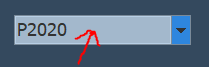

# SOFT252

The application Has 4 different area including Patient, Admin,Doctor, and secretary. Here Are All the data that is included when the application starts

All the code for the application is in the src folder 

UML located: src/Managment System Model/Class Diagrams/Managment System Model.cdg

Or (PDF Version): src/Managment System Model/Class Diagrams/PDFVersion.pdf

When you select using the drop down box you first have to click on the drop box (Not the arrow) to populate the drop down box

The User Names and password for the Application
Patient: 
* Username: P2020 | Password: 123
* Username: P2021 | Password: kelly111
* Username: P2022 | Password: 12311
* Username: P2023 | Password: 999

 Admin: 
* Username: A2020 | Password: 123

Doctor:
* Username: D2020 | Password: 234
* Username: D2021 | Password: L123

Secretary: 
* Username: S2020 | Password: John1

* Addtional Infomation that is included:

Account Requests:
* Name:Caleb | Address: Wood's Street
* Name:Felix | Address: 23 Some Street

Appointments:
* DoctorID :D2020 | PatientID:P2020 | Date:11/01/2020
* DoctorID :D2020 | PatientID:P2021 | Date:12/01/2020

Delete Request:
* PatientID: P2023

DoctorFeedback:
* DoctorID:D2020 | Rating:8 | Notes:Very Good
* DoctorID:D2020 | Rating:5 | Notes:They were ok

Medicine:
* Name: Piriteze
* Name: Synthroid
* Name: Crestor
* Name: Ventolin
* Name: Nexium
* Name: Advair Diskus
* Name: Lantus Solostar
* Name: Vyvanse
* Name: Lyrica
* Name: Januvia

Medicine Request:
* Name:PainKillers
* Name:Vapor

Perscription:
* DoctorID:D2020 | PatientID:P2020 | Notes:Look likes they need it | Medicine:Lyrica | Quantity:8 | Dosage:2 Times a day

Request Appointment:
* DoctorID:D2020 | PatientID:P2021 | Date:21/01/2020
* DoctorID:D2020 | PatientID:P2021 | Date:21/01/2020
